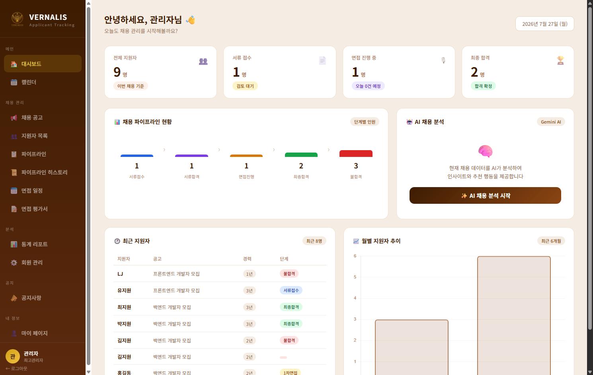
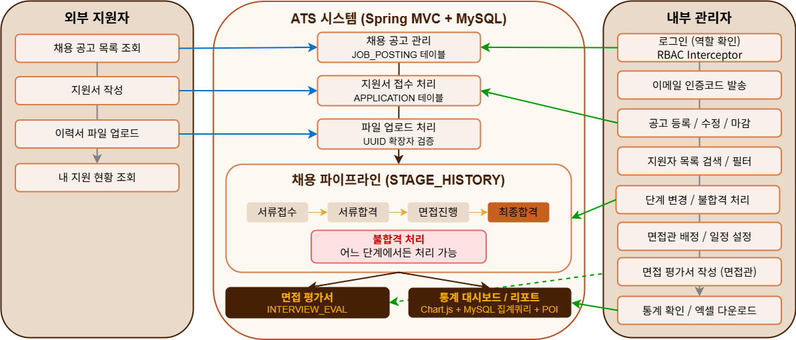
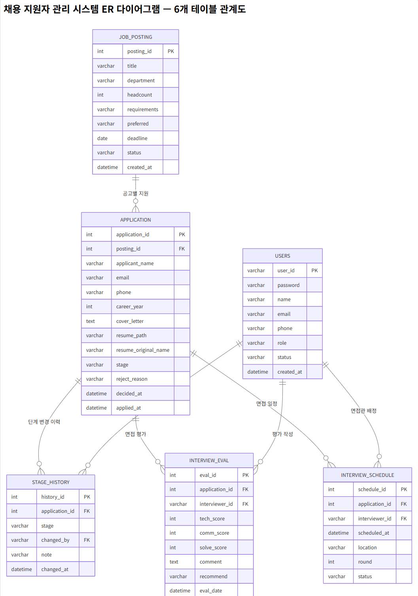
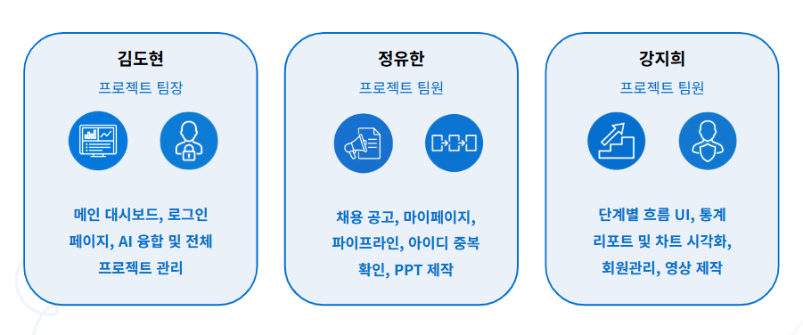

# 🌿 VERNALIS (AI 융합 채용 관리 시스템)

> **"기술적 완성도를 넘어 채용의 비즈니스 가치를 데이터로 증명하다"**

<!-- 대표 기술 스택 & 수상 이력 배지 -->


<br>

### 💡 서비스 소개
VERNALIS는 실무자의 고비용·저효율 수작업 채용 업무를 통합 관리 파이프라인으로 전환하고, 데이터 기반의 의사결정을 지원하는 기업향 ATS(Applicant Tracking System) 플랫폼입니다.

<br>

<!-- 대표 대시보드 이미지 구역 -->
<p align="center">
  
</p>

---

## 📌 Project Overview (프로젝트 개요)

### 💡 기획 배경 및 비즈니스 해결 과제
기존 채용 프로세스는 수작업 기반의 지원자 관리, 면접 일정 조율의 번거로움, 그리고 객관적 평가 데이터의 파편화로 인해 **고비용·저효율의 구조적 문제**를 안고 있었습니다. 

VERNALIS는 이러한 현업의 페인 포인트를 해결하기 위해 기획된 **기업향 통합 ATS(Applicant Tracking System) 플랫폼**입니다. 
* **채용 파이프라인 일원화**: 공고 등록부터 서류 접수, 면접 일정 조율, 객관적 평가 데이터 축적까지 전 과정을 단일 플랫폼으로 통합했습니다.
* **AI 융합 의사결정 지원**: 단순 반복 업무를 자동화하고, Gemini AI를 활용한 자기소개서 요약·면접 질문 추천 및 채용 퍼널 분석 데이터를 제공하여 전략적 채용 결정을 돕습니다.
* **엔터프라이즈급 보안 적용**: BCrypt 암호화, 2단계 이메일 인증(JavaMail), RBAC 기반 역할별 권한 제어(MASTER, HR, INTERVIEWER)를 구축해 데이터 무결성과 보안을 강화했습니다.

---

### 📐 전체 시스템 흐름도 (System Workflow)
외부 지원자의 셀프 접수 파이프라인과 내부 관리자의 채용 운영 흐름이 Spring MVC 및 MySQL 데이터베이스와 유기적으로 연동되는 전체 시스템 아키텍처 흐름도입니다.

<p align="center">
  
</p>

* **외부 지원자 (Applicant Portal)**: 공고 열람 → 이력서 작성 및 UUID 검증 파일 업로드 → 실시간 지원 현황 조회
* **ATS 백엔드 엔진 (Spring MVC + MySQL)**: `JOB_POSTING` 및 `APPLICATION` 처리 → `STAGE_HISTORY` 중심의 실시간 단계 전환/불합격 이력 추적
* **내부 관리자 (Admin & HR)**: RBAC 기반 권한 검증 → 공고 관리 및 파이프라인 드래그 앤 드롭 제어 → 면접 평가서 작성 및 Chart.js / POI 기반 통계 리포트 추출

---

## 🛠️ Tech Stack & Architecture (기술 스택 및 인프라)

### 1. Layered Tech Stack
| 구분 | 기술 스펙 (Tech Stack) |
| :--- | :--- |
| **Front-end** | JavaScript (ES6+), jQuery, HTML5 / CSS3, Ajax, Chart.js, FullCalendar.js, jQuery UI |
| **Back-end** | Java 17, Spring Boot 3.x, MyBatis, JSP & Servlet, Spring Interceptor (RBAC), BCrypt |
| **Database** | MySQL 8.0, MySQL Workbench |
| **AI & Library** | Google Gemini API (gemini-2.5-flash-lite), Apache POI, Java Mail API |
| **Environment & Tools** | Eclipse IDE, VS Code, Git / GitHub |

> 🔗 <a href="https://redmoondev3000.github.io/ATS_Project-final/tech_stack.html" target="_blank"><b>[📄 레이어별 상세 기술 스택 다이어그램 원본 실시간 보기 (HTML)]</b></a>

---

### 2. Multi-Container Deployment Architecture (Docker & AWS)
AWS EC2 인스턴스 상에서 **Docker Compose**를 활용하여 Spring Boot 애플리케이션과 MySQL 8.0 DB를 독립된 컨테이너 환경으로 멀티 빌드 및 배포했습니다.

```yaml
# docker-compose.yml 핵심 아키텍처 구조 요약
services:
  db:
    image: mysql:8.0
    ports: ["3306:3306"]
    environment:
      MYSQL_DATABASE: ats_db
      
  backend:
    build: /ATS_Project
    ports: ["8080:8080"]
    depends_on: [- db]
    volumes:
      - ./upload:/app/upload  # 이력서 파일 영속성 보존을 위한 호스트 Volume Mount
```

## 🗄️ Database Design (데이터베이스 설계)

### 📐 Entity Relationship Diagram (ERD)
VERNALIS의 데이터베이스는 데이터 무결성과 전형 단계별 이력 관리를 최우선으로 설계되었습니다. 
총 7개의 핵심 테이블이 3차 정규화(3NF) 준수 및 외래키(FK) 관계를 통해 유기적으로 연결되어 있습니다.

<p align="center">
  
</p>

---

### 💡 핵심 데이터베이스 설계 포인트
* **전형 이력 독립 분리 (`STAGE_HISTORY`)**: 지원자 테이블(`APPLICATION`)의 단순 상태 변경에 그치지 않고, 서류 접수부터 면접, 최종 합격/불합격까지의 모든 상태 변경 이력과 불합격 사유를 별도 이력 테이블로 적재하여 데이터 추적성을 확보했습니다.
* **평가 및 일정 데이터 정규화 (`INTERVIEW_SCHEDULE`, `INTERVIEW_EVAL`)**: 면접 일정과 면접관별 객관적 평가 점수 데이터를 다대일(N:1) 관계로 정규화하여 데이터 중복을 차단했습니다.
* **무결성 제어 및 가용성**: `USERS`, `JOB_POSTING` 등 핵심 테이블 간의 제약 조건을 통해 오염 데이터를 진입점에서 차단합니다.

---

## 👥 Team & Schedule (팀 구성, R&R 및 일정 관리)

### 1. 프로젝트 팀 구성 및 역할 분담 (R&R)

<p align="center">
  
</p>

* **김도현 (팀장)**: 메인 대시보드, 로그인 페이지, AI 융합 및 전체 프로젝트 관리
* **정유한 (팀원)**: **채용 공고, 마이페이지, 파이프라인(드래그 앤 드롭 단계 전환), 아이디 중복 확인, PPT 제작 및 문서화**
* **강지희 (팀원)**: 단계별 흐름 UI, 통계 리포트 및 차트 시각화(Chart.js), 회원관리, 영상 제작

---

### 2. 개발 일정 및 리스크 관리 (5주 간트차트)
5주간의 개발 기간 동안 무분별한 기능 확장 대신, **핵심 기능의 완결성과 디버깅·안정화에 리소스를 집중**하는 전략으로 진행되었습니다.

<p align="center">
  
</p>

> 🔗 **[📄 5주 개발 간트차트 원본 파일 보기 (HTML)](./ats_gantt_chart.html)**

* **1~2주차**: 요구사항 정의, DB 설계(ERD), 기본 CRUD 및 파이프라인 골격 구축
* **3~4주차**: 핵심 기능 개발 (채용 공고, 파이프라인 UI, AI 지원서 분석 연동, RBAC 권한 제어)
* **5주차**: 시스템 통합 테스트, 예외 처리 및 트러블슈팅, Docker / AWS EC2 multi-container 배포 환경 구축 및 문서화 완료[cite: 1]

---

## 🖥️ 정유한 전담 핵심 구현 기능 (기여도 100%)

<details>
<summary>📂 [채용 공고 CRUD & 지원자 셀프 포탈] 구현 명세</summary>

### 1. 채용 공고 비즈니스 로직 및 마감 자동화
- 기업 인사담당자가 활용하는 채용 공고 생성/조회/수정/삭제(CRUD) 파이프라인을 온전하게 개발했습니다.
- 공고 테이블(`JOB_POSTING`)의 deadline 데이터와 시스템 타임을 대조하는 전처리 엔진을 구축했습니다.

### 2. 외부 지원자용 접수 엔진
- 지원자가 들어와 채용 중인 공고 목록을 열람하고, 실제 이력서 정보를 폼으로 제출하는 '지원서 접수 및 전송 흐름'을 안정적으로 구현했습니다.


</details>

<details>
<summary>📂 [정밀 유효성 필터링 & 마이페이지] 구현 명세</summary>

### 1. 비동기 Ajax 연락처 중복 실시간 필터링
- 기존의 단순 가입 구조를 개선하여, 데이터 입력 단계에서 비동기 Ajax 통신을 트리거해 연락처 및 아이디의 실시간 중복 여부를 백엔드 DB와 대조 검증했습니다.
- 무분별한 데이터 오염을 진입점에서 차단함으로써 DB 인스턴스의 데이터 무결성을 100% 확보했습니다.

### 2. 세션 기반 고유 프로필 마이페이지 & 정규표현식 제어
- 세션에서 실시간으로 사용자 정보를 확인 및 캐싱하는 안전한 고유 프로필 관리 모듈(`MyPageController`)을 신설했습니다.
- 정규표현식(Regex) 검증 로직을 추가하여 비밀번호 수정 및 프로필 변경 시 암호 복합 조합 규칙을 통과하도록 전처리 과정을 엄격하게 설계했습니다.


</details>

---

## 🛠️ 핵심 트러블슈팅 (Troubleshooting)

### 1. 마이페이지 프로필 수정 시 Role 파라미터 null 제약 조건 위배 버그 해결
- **문제**: 마이페이지 프로필 수정 폼 전송 시, 일반 회원에게 노출되지 않는 `role` 필드가 null 상태로 전달되어 DB 저장 시 `Column 'role' cannot be null` 무결성 제약 오류 발생.
- **해결**: 컨트롤러(`MyPageController`) 내부 유효성 가드 로직을 개선했습니다. 파라미터 전송 검증 시 `role`이 존재하지 않을 경우, 세션 상에 안전하게 로드되어 있던 기존 권한 데이터(`userRole`)를 Fallback 값으로 자동 대입하도록 분기 처리하여 트랜잭션 정상 수행을 달성했습니다.

### 2. Ambiguous Handler Mapping 충돌 버그 수정 (URI 충돌 방어)
- **문제**: 로그인 진입 도메인과 마이페이지 도메인이 동일한 물리적 루트 경로인 `/user/mypage` (GET 방식)로 중복 매핑되면서, WAS(Tomcat) 기동 단계에서 핸들러 매핑 조기 충돌 에러 발생.
- **해결**: 중복 호출 구역을 완전히 리팩토링했습니다. 마이페이지 전용 엔드포인트를 단일 세션 범위인 `/mypage`로 도메인을 분리 구축하고 뷰 템플릿의 물리 반환 경로와 매핑을 깔끔하게 일대일 정렬하여 런타임 충돌을 해결했습니다.

---

## 🚀 프로젝트 관리 및 협업 성과 (정유한)
* **개발 리스크 제어**: 5주의 스프린트 기간 내 시스템 무결성을 확보하기 위해 보수적으로 기능 범위(Lock)를 설정하고 예외 처리 및 디버깅에 집중했습니다.
* **유연한 R&R 조율 및 성과**: 현업 멘토단 및 강사님 피드백을 수용하는 과정에서 발생한 개발 작업 중복을 해결하고자 적극적으로 역할 조율을 단행했습니다. 시연 시나리오 기획 및 프레젠테이션(PPT) 설계를 전담하여 팀 전체의 산출물 완성도를 최적화했고, 최종적으로는 **우수상 수상**이라는 결실로 프로젝트를 마무리 할 수 있었습니다.
